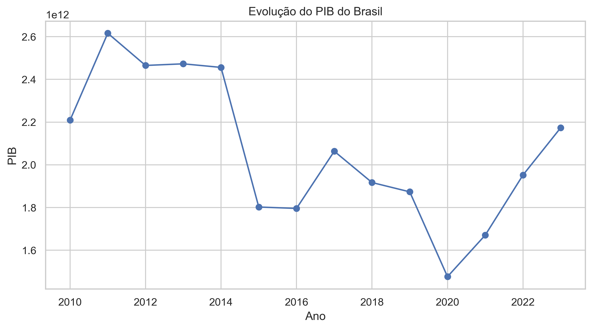
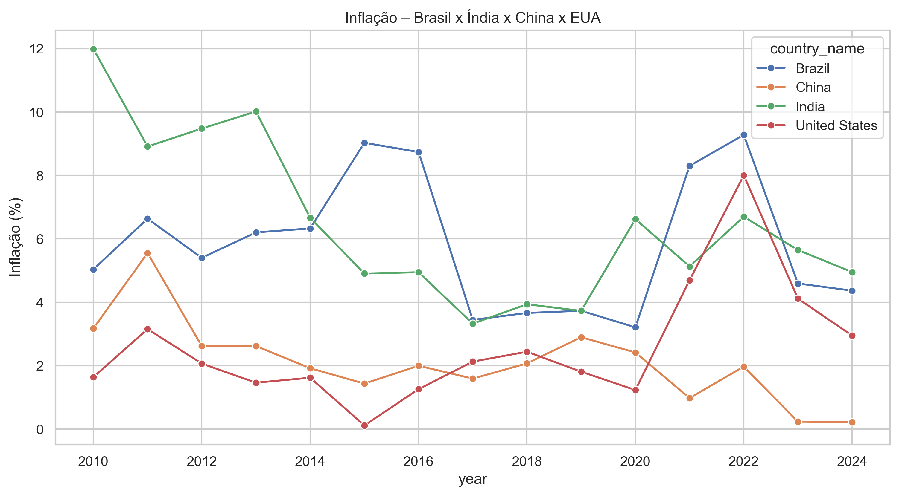
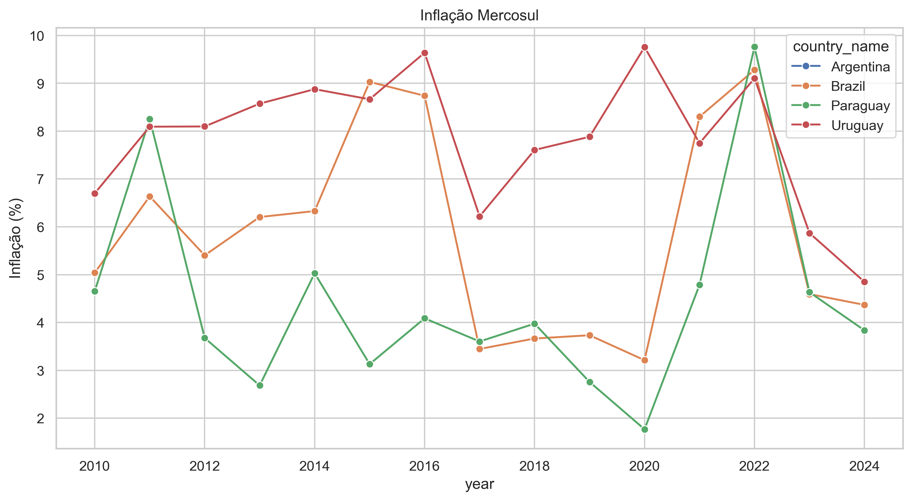
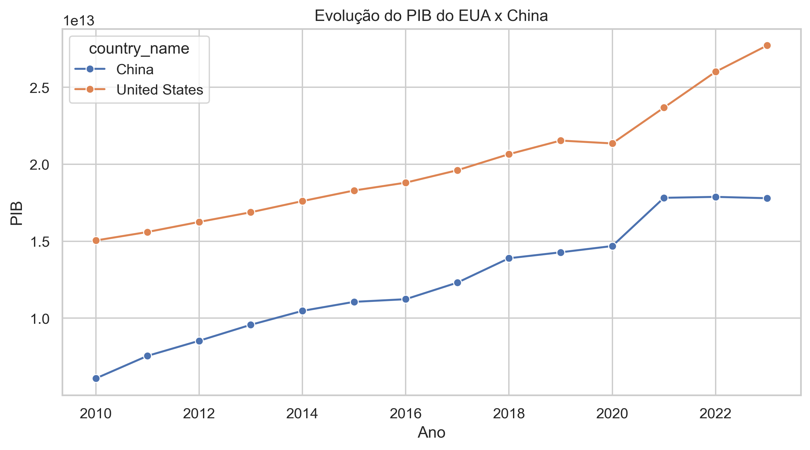
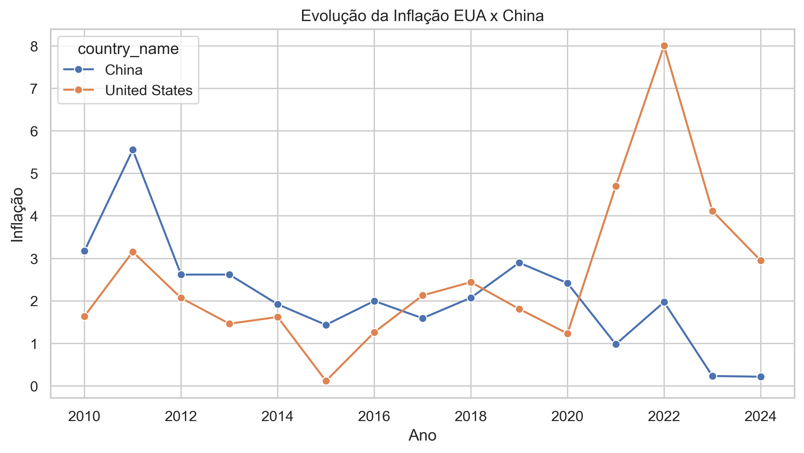
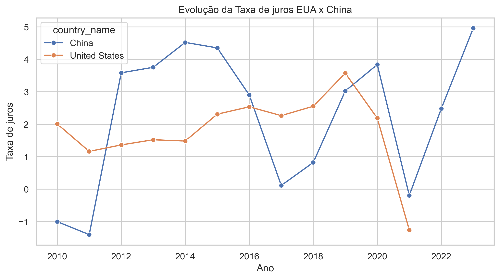

<<<<<<< HEAD
# 📊 Indicadores Econômicos Globais – Análise Exploratória com Python

Este projeto realiza uma análise exploratória de indicadores econômicos globais (PIB, inflação, taxa de juros, entre outros), utilizando dados extraídos do Kaggle. O objetivo é identificar padrões econômicos entre países e suas evoluções ao longo do tempo, com foco em países do Mercosul e nas maiores economias do mundo (EUA, China).

## 📌 Sobre o Dataset

- **Fonte**: Kaggle ([Global Economic Indicators 2010–2025](https://www.kaggle.com/datasets/tanishksharma9905/global-economic-indicators-20102025))
- **Período**: 2010 a 2025
- **Cobertura**: +200 países
- **Principais variáveis**:
  - `GDP`: Produto Interno Bruto
  - `Inflation`: Inflação
  - `Interest Rate`: Taxa de juros
  - `Unemployment`: Desemprego.

---

## 🔍 Análises Realizadas

- Verificação de valores ausentes e tipos de dados
- Estatísticas descritivas por país
- Evolução do PIB do Brasil (2010–2025)
- Comparação da inflação entre países: Brasil, Índia, China, EUA
- Comparação da inflação entre países do Mercosul
- Comparação do PIB, inflação e taxas de juros das maiores economias do mundo: EUA e China

## 📈 Principais Gráficos

### 📊 Evolução do PIB – Brasil

### 📊 Inflação – Brasil x Índia x China x EUA

### 📊 Inflação – Países do Mercosul

### 📊 Evolução do PIB – EUA x China

### 📊 Inflação – EUA x China

### 📊 Taxa de Juros – EUA x China

## 🚀 Próximos Passos

- Criar visualizações interativas com Power BI
- Simular consultas com SQL para análise de subgrupos
- Publicar no LinkedIn com insights obtidos

---

## 🛠️ Tecnologias Utilizadas

- Python (Pandas, Seaborn, Matplotlib)
- Jupyter Notebook
- Power BI (em breve)
- Git e GitHub

---

## 👨‍💻 Autor

Vinicius Fantini  
Economista | Estudante de Data Science | Apaixonado por dados econômicos  
[LinkedIn](https://www.linkedin.com/in/vinicius-fantini-cea-42101816a/) • [GitHub](https://github.com/Vinicius-Fantini)
